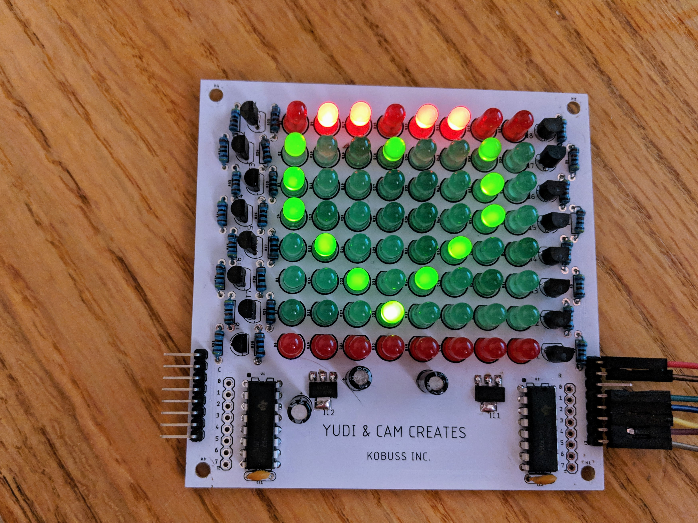
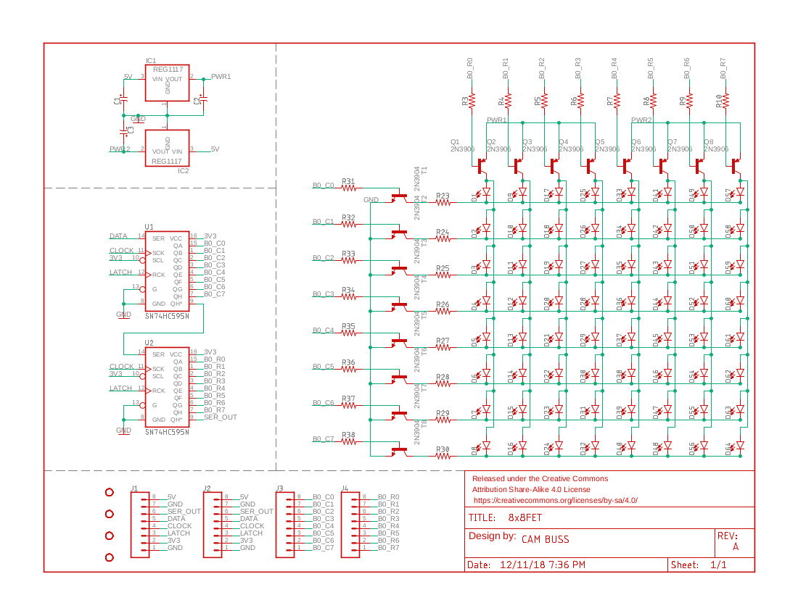
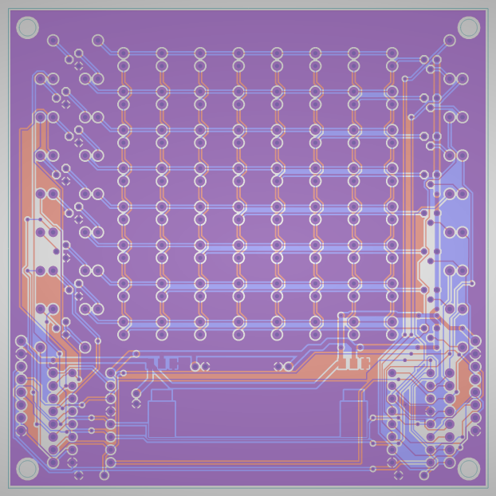

# 8x8-led-matrix

LED Matrix with a custom PCB to have shift registers drive FETs to a multi-plexed 8X8 LED matrix. Controlled by an ESP8266.

### Finished Product

### Schematic:

### PCB Traces:
